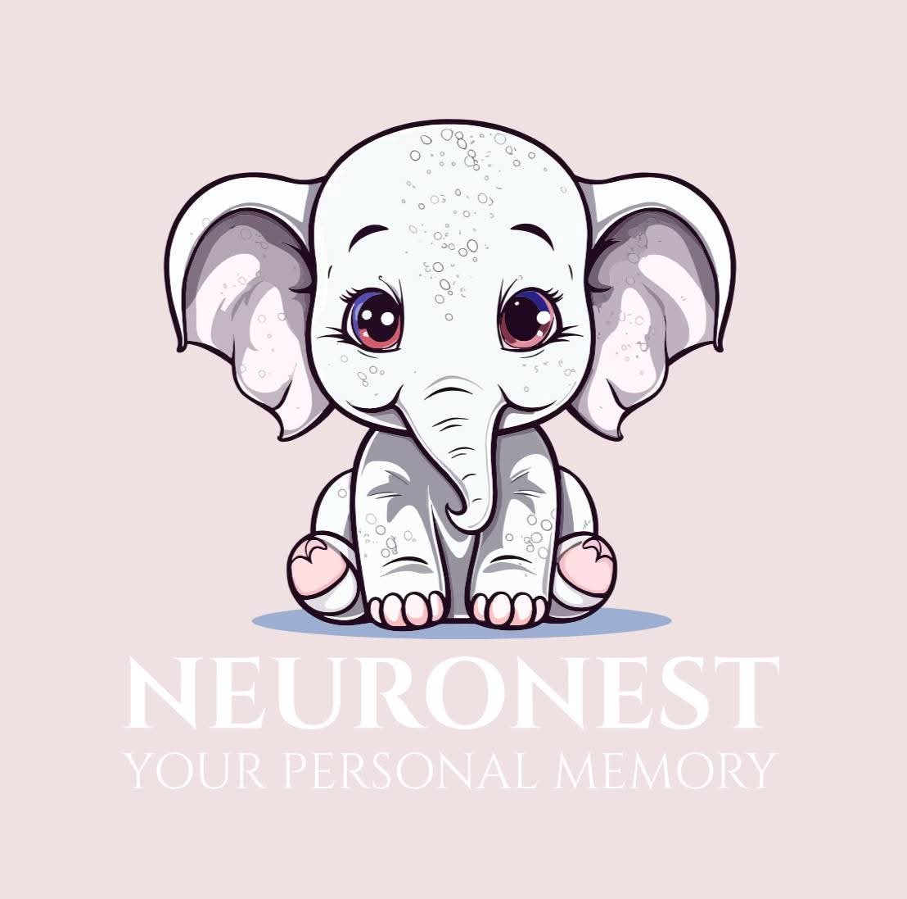

<p align="center">
  
</p>

<h1 align="center">NEURONEST</h1>

# 🧠🏠 NEURONEST - AI-Powered Dementia Care Platform

## 🌟 Transforming Dementia Care Through Technology

NEURONEST is an innovative AI-powered platform designed to enhance the quality of life for dementia patients and their caregivers. Our solution combines cutting-edge technology with compassionate care to provide safety, cognitive stimulation, and emotional support.

## 🚀 Key Features

### 👁️ Smart Recognition Systems
- **Face Recognition**: Helps patients connect faces to memories
- **Object Identification**: Identifies everyday objects to reduce confusion
- **Stranger Alert**: Notifies caregivers about unfamiliar faces

### 🛡️ Safety & Monitoring
- **Location Tracking**: GPS-enabled wearables prevent wandering incidents
- **Safe Zones**: Geofencing alerts when patients leave designated areas
- **Emergency SOS**: One-touch emergency alerts with location sharing

### 💊 Medication Management
- Personalized medication reminders
- Dosage tracking and history
- Caregiver notifications for missed doses

### 🧠 Cognitive Activities
- Memory matching games
- Word association puzzles
- Pattern recognition exercises
- Progress tracking and adaptive difficulty

### 📔 Digital Journaling
- Voice and text journal entries
- Memory album creation
- Sentiment analysis for caregiver insights

### 🎵 Therapeutic Features
- Music therapy playlists
- Calming soundscapes
- Personalized audio reminiscence

## 📱 Getting Started

### Prerequisites
- Python 3.8+
- Node.js 14+ (for web interface)
- MongoDB (for data storage)

### Installation
```bash
# Clone the repository
git clone https://github.com/yourusername/neuro-nest.git

# Install backend dependencies
cd neuro-nest/backend
pip install -r requirements.txt

# Install frontend dependencies
cd ../frontend
npm install
